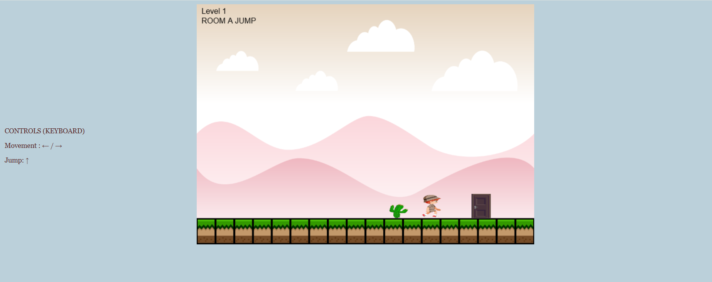
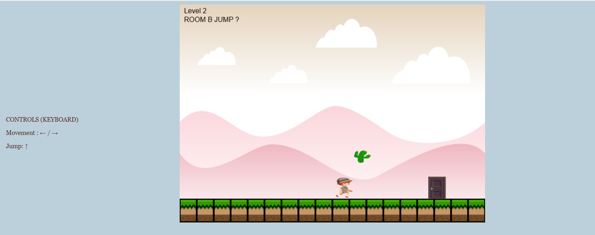
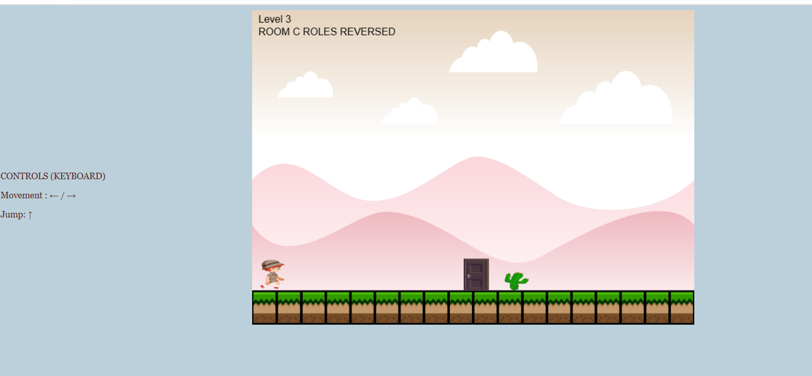

# Reversal Rooms Oyunu 
Oyunun gerçek adı: Reversal Rooms Bağlantı linki https: https://taelsdafoox.itch.io/reversal-rooms 
Bu oyun javascript ve HTML5 canvas kullanarak oluşturulmuş Reversal Rooms'un mantığından esinlenerek tasarlanmış 2D bir oyun. Bu oyunda oyuncular, A'dan C ye sıralanmış odalar arasında bulmaca çözerek karakteri 
kapıya ulaştırmaya çalışır. Toplamda 3 seviyeden oluşan bu oyun kullanıcıya farklı bir deneyim sunar. 
# İçindekiler
 - [Nasıl Oynanır?](#nasıl-oynanır)
 - [Mekanikler](#mekanikler)
 - [Oyun İçi Görseller](#oyun-içi-görseller)
 - [Oynanış Videosu](#oynanış-videosu)
 - [Kullanılan Teknolojiler](#kullanılan-teknolojiler)
 - [Varlıklar](#varlıklar)
 ## Nasıl Oynanır?
- Çevrimdışı Oynama
 
  Bir web tarayıcısında index.html dosyasını çalıştırmak yeterli olur.
- Çevrimiçi Oynama
 
  Online olarak tarayıcıda açmak için aşağıdaki linke tıklanması yeterli olur.
  
  https://elifkaraa.github.io/reversal_rooms_game/
## Mekanikler
⬅️ Sola hareket

➡️ Sağa hareket

⬆️ Yukarı zıplama
Hangi nesnenin hangi hareketi yaptığını sen bulmalısın.  
## Oyun İçi Görseller

Level1 de sadece karakterimiz hareket ediyor. Engele değmeden kapıya ulaşılması gerekir.  

Level2 de hem karakerimiz hem de engel hareket ediyor. Kimin ne yaptığının bulunması ve karakterin kapıya ulaştırılması gerekir.

Level3 de ise kapı nesnesi hareket ediyor. Engele değmeden karakterin kapıya ulaştırılması gerekir.

## Oynanış Videosu 
Oynama videosuna alttaki linkten erişebilirsin:
## Kullanılan Teknolojiler
- HTML5 Canvas
- JavaScript
- Css

## Varlıklar
🔊 Ses Efektleri
[ SoundBible](https://soundbible.com/free-sound-effects-3.html)  

🖼️ Görsel Varlıklar
[Open-game-art.org](https://opengameart.org/content/)
